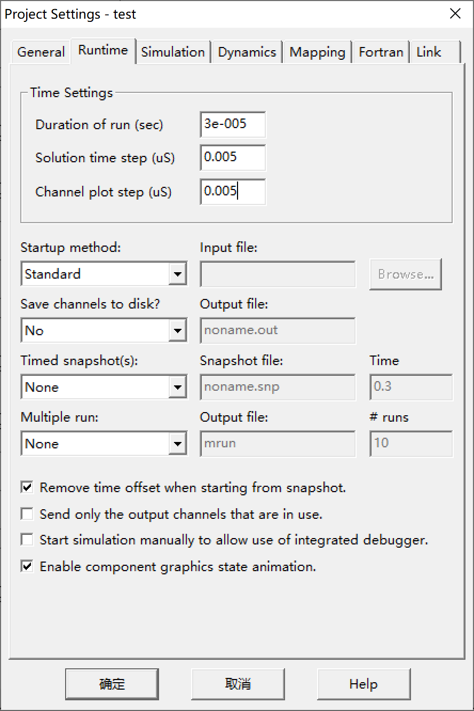
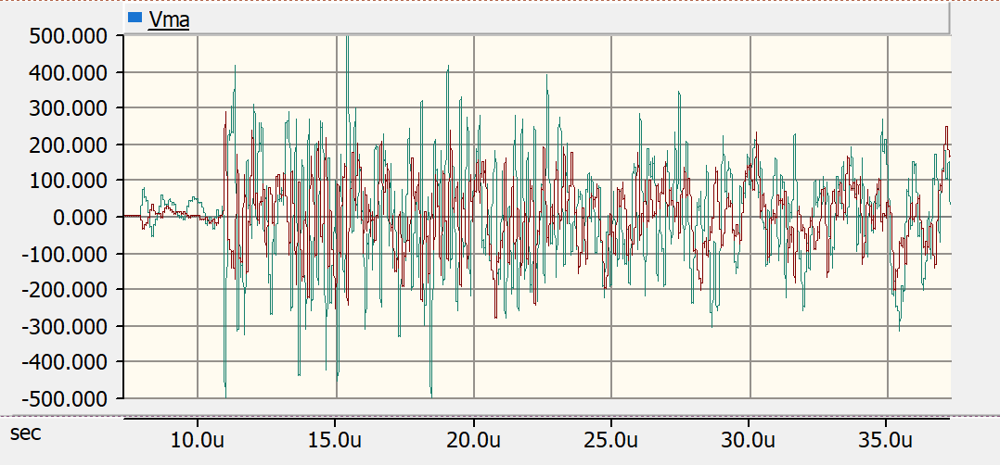
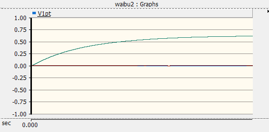
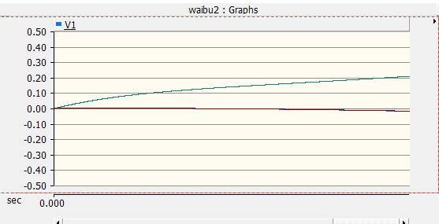

**变电站雷电过电压计算研究报告**

刘畅 王宇瑄 罗杨 张家禾 张庭梁

项目模型源码以及说明文档详见GitHub

<https://github.com/TingliangZhang/PSCAD>

Microsoft Word to Markdown Using
[Pandoc](https://pandoc.org/MANUAL.html)

> pandoc \--extract-media . \'.\\report.docx\' -t markdown -o README.md

项目要求和内容
--------------

**项目内容**

•近区与远区不同雷击点的结果比较

•不同运行方式的比较

•杆塔冲击接地电阻的影响

•避雷器布置和参数的影响

项目目标

•各主要设备处的过电压水平

•避雷器在各种情况下的通流容量

•各主要设备的绝缘水平和绝缘配合裕度

**仿真模型的建立**

输电线路

基本理论

PSCAD中的实现（Pi型、Bergeron模型、

JMarti模型）

具体参数的设定

金属氧化锌避雷器

基本理论

PSCAD中的实现（对非线性特性的模拟）

具体参数的设定

杆塔

基本理论

PSCAD中的实现（绝缘子串、塔架、接地电阻等）

具体参数的设定

•相关理论

•部件等值（母线、管道、PT等）

•PSCAD中的实现

•有关参数设定

变压器

基本理论

PSCAD中的实现（经典模型、UMEC模型）

在雷电过电压研究中的简化

PSCAD运行环境设置

•计算时间

•计算步长

•图形导出及分析

•数据导出及分析

问题与思考

•如何使各设备仿真模型更好的模拟实际物理设备（理论角度和工程计算角度两方面阐述）

•如何在计算过程中考虑运行电压的影响

•计算结果对各元件参数的敏感度分析

实验过程和Trouble shooting
--------------------------

我们的实验软件经历了从PSCAD4.5到4.2到4.6的转换

### PSCAD4.5的尝试

4.5无法导入部分老师提供的psc文件，折腾了一天之后我们决定还是使用老版本的4.2

### 安装配置PSCAD4.2的挣扎

要是安装pscad4.2的话先卸掉pscadX4（PSCAD4.5），不然破解不了

VS2010也最好全卸掉

{width="3.070601487314086in"
height="1.3159722222222223in"}

问题解决：

安装Fortran，老师给的目录里面

对文件SETUPX.EXE右键，修改属性中的兼容性，选择"windowsXP（Service Pack
2） "，并勾选特权等级："以管理员身份运行此程序"。

注意：安装之前卸载其他Fortran，否则不能打开SETUPX.EXE

{width="5.768055555555556in"
height="3.245138888888889in"}

{width="5.768055555555556in"
height="3.1465277777777776in"}

注意！！！！

一定要加环境变量！！！

{width="4.244792213473316in"
height="5.91294728783902in"}

.如果电脑装过vc，要把"我的电脑"---"属性"---"高级系统设置"---"高级"---"环境变量"中的lib变量删除。不用删系统变量的lib。

{width="5.768055555555556in"
height="3.2444444444444445in"}

{width="5.768055555555556in"
height="3.1243055555555554in"}

每次告诉我license无效我都得重新激活一次才行，否则create new
component这个按钮会变成灰色的！

{width="5.768055555555556in"
height="5.623305993000875in"}

fortran安装

**=======================================================**

<http://muchong.com/t-2715875-1>

在网上下个GNU fortran安装，在pscad里设置一下

<https://gcc.gnu.org/wiki/GFortranBinaries#Windows>

MinGW-w64 - for 32 and 64 bit Windows

<https://sourceforge.net/projects/mingw-w64/files/Toolchains%20targetting%20Win32/Personal%20Builds/mingw-builds/installer/mingw-w64-install.exe/download>

{width="5.489623797025372in"
height="4.020862860892389in"}

==========================================================

**学习资料**

<https://zhuanlan.zhihu.com/p/30626835>

**必要的设置**

PSCAD运行环境设置

•计算时间

•计算步长

•图形导出及分析

•数据导出及分析

{width="3.838542213473316in"
height="4.538209755030621in"}

{width="2.770436351706037in"
height="4.155655074365704in"}
{width="2.8691469816272965in"
height="4.303719378827647in"}

在设置model的时候，Page module 必选。

**成功啦**

{width="5.768055555555556in"
height="3.1479166666666667in"}

Test 示波器使用

{width="5.768055555555556in"
height="3.1484306649168854in"}

Test2 模块使用

{width="5.768055555555556in"
height="3.1239632545931757in"}

**但是在4.2里模块不能直接复制，这为我们造成的很大的困扰，比如杆塔模型需要用很多次，一次次自己画是不可能的，这是我们放弃4.2的主要原因。**

{width="5.768055555555556in"
height="3.1243055555555554in"}

另一个原因是GIS-Transformer.psc需要MATLAB，且只支持老版本MATLAB

### PSCAD4.6.2环境开发和复制粘贴功能的解决方案

最后我们决定使用新的4.6版本，虽然新版本的pscx文件不能向下兼容低版本，即无法使用低版本PSCAD打开。

我们通过Import功能导入的部分给定的model，剩余的部分由我们自行绘制。

单Project复制

直接在打开文件的时候不选择打开选择Import就可以导入老师的project到自己的工程里。右击model直接copy
transfer就可以过来。

跨project复制

{width="3.1881944444444446in"
height="2.7194444444444446in"}{width="2.3050185914260717in"
height="2.5425995188101487in"}

A是只导出当前"元件"的"代码"

B是同时导出当前"元件"及选中元件用过的"其他原件"代码，把它们的definition打包到一个文件里

{width="5.281944444444444in"
height="3.1152777777777776in"}

definition相当于源文件，复制粘贴只是贴个快捷方式{width="5.763888888888889in"
height="3.4868055555555557in"}

搭建的模型说明
--------------

{width="5.768055555555556in"
height="3.6847222222222222in"}

上图为变电站第一部分（左侧）

{width="2.6029396325459317in"
height="3.9621544181977253in"}

上图为变电站左侧部分

两者连接关系为：

{width="3.1946084864391953in"
height="1.9792683727034122in"}

下图为输电线、雷击点和无穷大电网模型：

{width="5.768055555555556in"
height="1.042361111111111in"}

整个模型的形式如下（单线单变情况下）：

{width="5.768055555555556in"
height="1.895138888888889in"}

实验结果和数据分析
------------------

### 不同运行方式比较

#### 单线单变

（1）进线PT处电压Vlpt

{width="5.768055555555556in"
height="2.707638888888889in"}

（2）母线PT处电压Vmpt

{width="5.768055555555556in"
height="2.647222222222222in"}

{width="5.768055555555556in"
height="2.627083333333333in"}

（3）变压器入口处PT电压Vtpt

{width="5.768055555555556in"
height="2.692361111111111in"}

（4）进线避雷器处电压Vla

{width="5.768055555555556in"
height="2.6694444444444443in"}

（5）母线避雷器处电压Vma

开始时的波形：

{width="5.768055555555556in"
height="2.686111111111111in"}

0.1ms后稳定，稳定时的波形

{width="5.768055555555556in"
height="2.7743055555555554in"}

（6）高抗避雷器处电压Vra

{width="5.768055555555556in"
height="2.686111111111111in"}

（7）变压器入口避雷器处电压Vta

{width="5.768055555555556in"
height="2.678472222222222in"}

（8）高抗入口处电压Vl

{width="5.768055555555556in"
height="2.6458333333333335in"}

（9）串补两侧电压Vc

{width="5.768055555555556in"
height="2.620138888888889in"}

（10）变压器入口处电压Vt

{width="5.768055555555556in"
height="2.627083333333333in"}

（11）H-GIS入口电压Vg

{width="5.768055555555556in"
height="2.6881944444444446in"}

#### 单线双变

单线双变

（1）进线PT处电压Vlpt

{width="5.768055555555556in"
height="2.7069444444444444in"}

最高达到0.4907

（2）母线PT处电压Vmpt

开始时的波形：

{width="5.768055555555556in"
height="2.651388888888889in"}

25us后稳定，稳定时的波形：

{width="5.768055555555556in" height="2.69375in"}

最高达到132.2

（3）变压器入口处PT电压Vtpt

{width="5.768055555555556in"
height="2.626388888888889in"}

最高达到6.873

{width="5.768055555555556in"
height="2.652083333333333in"}

最高达到8.522

（4）进线避雷器处电压Vla

{width="5.768055555555556in"
height="2.629166666666667in"}

最高达到750.2

（5）母线避雷器处电压Vma

开始时的波形：

{width="5.768055555555556in"
height="2.654861111111111in"}

0.1ms后稳定，稳定时的波形：

{width="5.768055555555556in"
height="2.6381944444444443in"}

最高达到568.8

（6）高抗避雷器处电压Vra

{width="5.768055555555556in"
height="2.6180555555555554in"}

最高达到724.0

（7）变压器入口避雷器处电压Vta

{width="5.768055555555556in"
height="2.6326388888888888in"}

{width="5.768055555555556in"
height="2.6416666666666666in"}

（8）高抗入口处电压Vl

{width="5.768055555555556in"
height="2.611111111111111in"}

最高达到2.673

（9）串补两侧电压Vc

{width="5.768055555555556in"
height="2.703472222222222in"}

最高达到5.131

（10）变压器入口处电压Vt

{width="5.768055555555556in"
height="2.645138888888889in"}

{width="5.708333333333333in"
height="2.5729166666666665in"}

（11）H-GIS入口电压Vg

{width="5.768055555555556in"
height="2.7194444444444446in"}

最高达到928.9

#### 双线单变

双线单变

（1）进线PT处电压Vlpt

{width="5.768055555555556in"
height="2.9402777777777778in"}

（2）母线PT处电压Vmpt

Vmpt1最高达到62.32

{width="5.739583333333333in"
height="2.8541666666666665in"}

Vmpt2最高达到57.31

{width="5.75in" height="2.7604166666666665in"}

（3）变压器入口处PT电压Vtpt

{width="5.768055555555556in"
height="2.873611111111111in"}

（4）进线避雷器处电压Vla：最高达到313.71

{width="5.768055555555556in"
height="2.8270833333333334in"}

（5）母线避雷器处电压Vma：最高达到231.05

{width="5.768055555555556in"
height="2.8333333333333335in"}

（6）高抗避雷器处电压Vra：最高达到364.58

{width="5.768055555555556in"
height="2.7909722222222224in"}

（7）变压器入口避雷器处电压Vta

{width="5.768055555555556in"
height="2.678472222222222in"}

（8）高抗入口处电压Vl

{width="5.768055555555556in"
height="2.816666666666667in"}

（9）串补两侧电压Vc

{width="5.768055555555556in"
height="2.686111111111111in"}

（10）变压器入口处电压Vt

{width="5.768055555555556in"
height="2.627083333333333in"}

（11）H-GIS入口电压Vg：最高达到407.4

{width="5.768055555555556in"
height="2.9868055555555557in"}

### 杆塔接地阻抗的影响

分别测量了杆塔接地电阻分别为25Ω和15Ω时的波形：

（1）进线PT处电压Vlpt

25Ω：

{width="5.768055555555556in"
height="2.6347222222222224in"}

15Ω：

{width="5.768055555555556in"
height="2.609722222222222in"}

（2）母线PT处电压Vmpt

25Ω：

{width="5.768055555555556in"
height="2.6847222222222222in"}

15Ω：

{width="5.768055555555556in"
height="2.654861111111111in"}

（3）变压器入口处PT电压Vtpt

25Ω：

{width="5.768055555555556in"
height="2.592361111111111in"}

15Ω：

{width="5.768055555555556in"
height="2.6104166666666666in"}

（4）进线避雷器处电压Vla

25Ω：

{width="5.768055555555556in"
height="2.6868055555555554in"}

15Ω：

{width="5.768055555555556in"
height="2.678472222222222in"}

（5）母线避雷器处电压Vma

25Ω：

{width="5.768055555555556in" height="2.7in"}

15Ω：

{width="5.768055555555556in"
height="2.7381944444444444in"}

（6）高抗避雷器处电压Vra

25Ω：

{width="5.768055555555556in"
height="2.6083333333333334in"}

15Ω：

{width="5.768055555555556in"
height="2.6840277777777777in"}

（7）变压器入口避雷器处电压Vta

25Ω：

{width="5.768055555555556in"
height="2.6631944444444446in"}

15Ω：

{width="5.768055555555556in"
height="2.6631944444444446in"}

（8）高抗入口处电压Vl

25Ω：

{width="5.768055555555556in"
height="2.654166666666667in"}

15Ω：

{width="5.768055555555556in"
height="2.6430555555555557in"}

（9）串补两侧电压Vc

25Ω：

{width="5.768055555555556in"
height="2.651388888888889in"}

15Ω：

{width="5.768055555555556in"
height="2.6444444444444444in"}

（10）变压器入口处电压Vt

25Ω：

{width="5.768055555555556in"
height="2.661111111111111in"}

15Ω：

{width="5.768055555555556in"
height="2.661111111111111in"}

（11）H-GIS入口电压Vg

25Ω：

{width="5.768055555555556in"
height="2.6729166666666666in"}

15Ω：

{width="5.768055555555556in"
height="2.7555555555555555in"}

### 雷击点近端远端比较

**近端：**

（1）进线PT处电压Vlpt

{width="5.708333333333333in"
height="2.8020833333333335in"}

（2）母线PT处电压Vmpt：

{width="5.708333333333333in"
height="2.7708333333333335in"}

{width="5.768055555555556in"
height="2.801388888888889in"}

（3）变压器入口处PT电压Vtpt

{width="5.768055555555556in"
height="2.8430555555555554in"}

（4）进线避雷器处电压Vla：最大达到252.1

{width="5.645833333333333in"
height="2.9791666666666665in"}

（5）母线避雷器处电压Vma：最大达到189.2

{width="5.768055555555556in"
height="2.873611111111111in"}

（6）高抗避雷器处电压Vra：最大达到227

{width="5.768055555555556in"
height="2.935416666666667in"}

（7）变压器入口避雷器处电压Vta

{width="5.768055555555556in"
height="2.873611111111111in"}

（8）高抗入口处电压Vl

{width="5.768055555555556in"
height="2.951388888888889in"}

（9）串补两侧电压Vc

{width="5.768055555555556in"
height="2.7819444444444446in"}

（10）变压器入口处电压Vt

{width="5.768055555555556in"
height="2.627083333333333in"}

（11）H-GIS入口电压Vg

{width="5.768055555555556in"
height="2.683333333333333in"}

**远端：**

（1）进线PT处电压Vlpt

{width="5.520833333333333in" height="2.875in"}

（2）母线PT处电压Vmpt：

Vmpt1最大达到1.59

{width="5.768055555555556in"
height="2.7527777777777778in"}

Vmpt2最大达到1.61

{width="5.768055555555556in"
height="2.765972222222222in"}

（3）变压器入口处PT电压Vtpt

{width="5.71875in" height="2.78125in"}

（4）进线避雷器处电压Vla：最大达到0.61

{width="5.768055555555556in"
height="2.946527777777778in"}

（5）母线避雷器处电压Vma：最大达到1.55

{width="5.768055555555556in"
height="2.832638888888889in"}

（6）高抗避雷器处电压Vra：最大达到0.57

{width="5.739583333333333in"
height="2.8020833333333335in"}

（7）变压器入口避雷器处电压Vta

{width="5.768055555555556in"
height="2.873611111111111in"}

（8）高抗入口处电压Vl

{width="5.768055555555556in"
height="2.8270833333333334in"}

（9）串补两侧电压Vc

{width="5.768055555555556in"
height="2.852777777777778in"}

（10）变压器入口处电压Vt

{width="5.768055555555556in"
height="2.627083333333333in"}

（11）H-GIS入口电压Vg，最大达到1.50

{width="5.768055555555556in"
height="2.785416666666667in"}

综上可见，雷击位置比起近端，当雷击在远端时，引起的过电压幅值大大减小。
