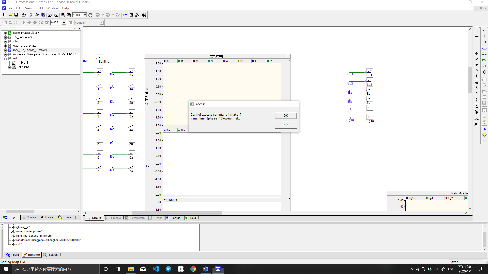
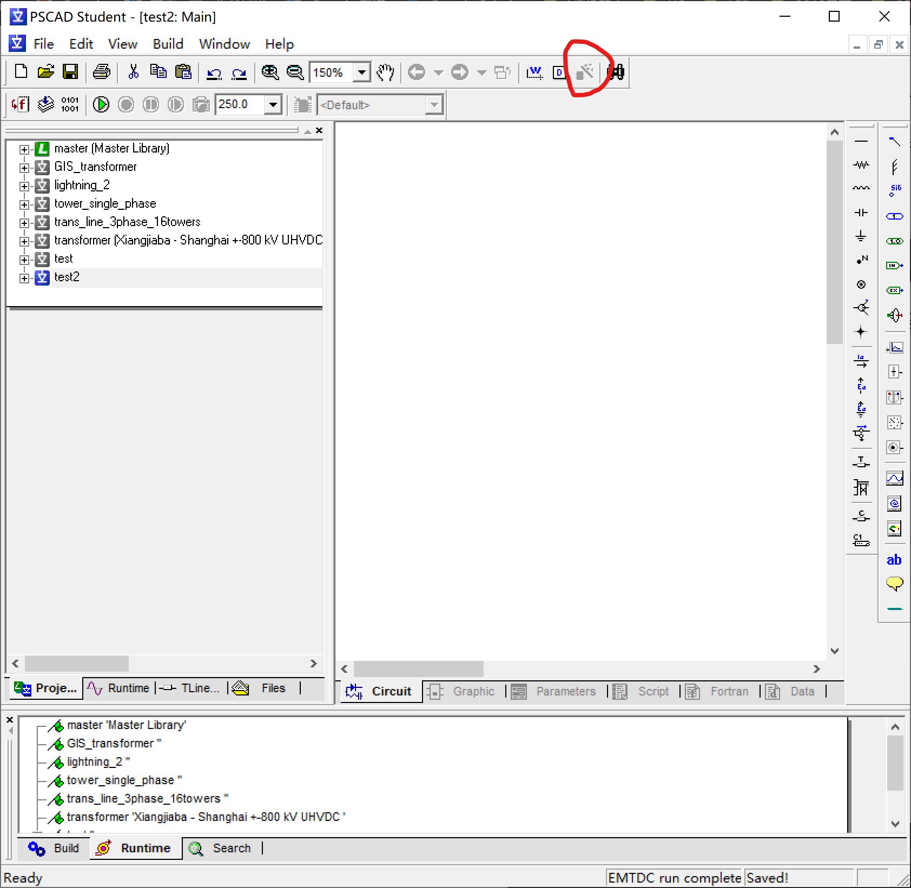

# 项目内容

•近区与远区不同雷击点的结果比较

•不同运行方式的比较

•杆塔冲击接地电阻的影响

•避雷器布置和参数的影响

项目目标

•各主要设备处的过电压水平

•避雷器在各种情况下的通流容量

•各主要设备的绝缘水平和绝缘配合裕度

**仿真模型的建立**

输电线路

基本理论

PSCAD中的实现（Pi型、Bergeron模型、

JMarti模型）

具体参数的设定

金属氧化锌避雷器

基本理论

PSCAD中的实现（对非线性特性的模拟）

具体参数的设定

杆塔

基本理论

PSCAD中的实现（绝缘子串、塔架、接地电阻等）

具体参数的设定

•相关理论

•部件等值（母线、管道、PT等）

•PSCAD中的实现

•有关参数设定

变压器

基本理论

PSCAD中的实现（经典模型、UMEC模型）

在雷电过电压研究中的简化

PSCAD运行环境设置

•计算时间

•计算步长

•图形导出及分析

•数据导出及分析

问题与思考

•如何使各设备仿真模型更好的模拟实际物理设备（理论角度和工程计算角度两方面阐述）

•如何在计算过程中考虑运行电压的影响

•计算结果对各元件参数的敏感度分析

# Trouble shooting

要是安装pscad4.2的话先卸掉pscadX4，不然破解不了

VS2010也最好全卸掉

问题解决：

安装Fortran，老师给的目录里面

对文件SETUPX.EXE右键，修改属性中的兼容性，选择“windowsXP（Service Pack 2）
”，并勾选特权等级：“以管理员身份运行此程序”。

注意：安装之前卸载其他Fortran，否则不能打开SETUPX.EXE

注意！！！！

一定要加环境变量！！！

.如果电脑装过vc，要把“我的电脑”—“属性”—“高级系统设置”—“高级”—“环境变量”中的lib变量删除。不用删系统变量的lib。

**以下内容不用管**

**=======================================================**

<http://muchong.com/t-2715875-1>

在网上下个GNU fortran安装，在pscad里设置一下

<https://gcc.gnu.org/wiki/GFortranBinaries#Windows>

MinGW-w64 - for 32 and 64 bit Windows

<https://sourceforge.net/projects/mingw-w64/files/Toolchains%20targetting%20Win32/Personal%20Builds/mingw-builds/installer/mingw-w64-install.exe/download>

\==========================================================

# 学习资料

<https://zhuanlan.zhihu.com/p/30626835>

# 必要的设置

PSCAD运行环境设置

•计算时间

•计算步长

•图形导出及分析

•数据导出及分析

 

# 成功啦

pandoc -t gfm --extract-media . -o README.md Debug.docx
